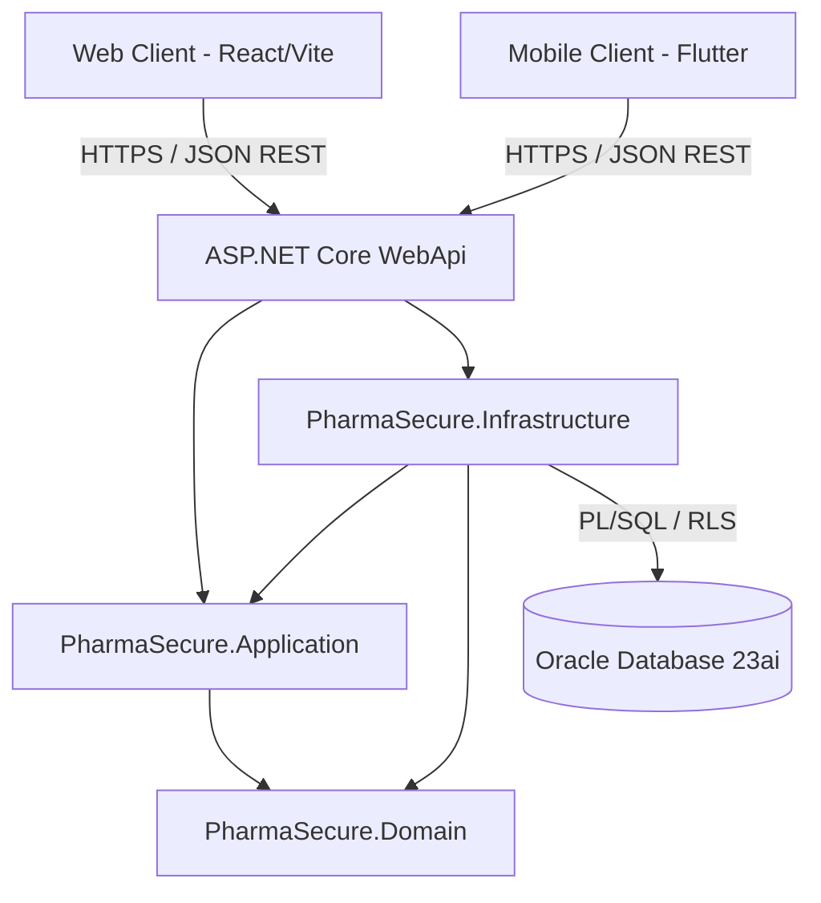

# PharmaSecure Architecture Diagrams

This directory stores Mermaid and visual architectural diagrams.

## System Architecture Overview

```mermaid
graph TD
    ClientWeb[Web Client - React/Vite] -->|HTTPS / JSON REST| WebApi[ASP.NET Core WebApi]
    ClientMobile[Mobile Client - Flutter] -->|HTTPS / JSON REST| WebApi
    WebApi --> Application[PharmaSecure.Application]
    WebApi --> Infrastructure[PharmaSecure.Infrastructure]
    Infrastructure --> Application
    Infrastructure --> Domain[PharmaSecure.Domain]
    Application --> Domain
    Infrastructure -->|PL/SQL / RLS| SqlServer[(Oracle Database 23ai)]
```
